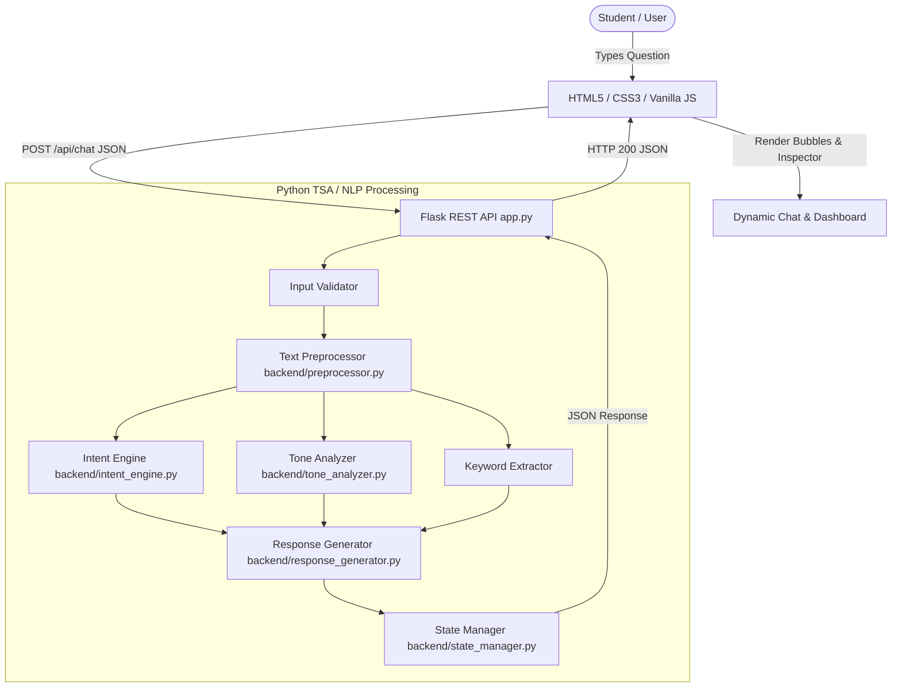
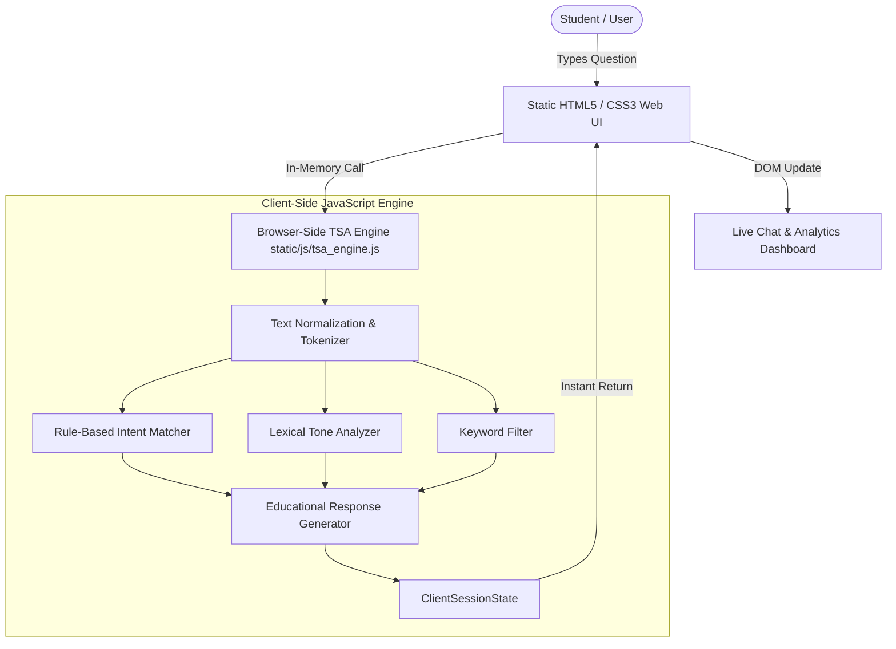

# EduAssist — Intelligent Student Support & Academic Guidance Chatbot

> **Tagline:** *Ask. Understand. Get Guidance.*  
> **Domain:** Text, Speech and Analysis (TSA) / Natural Language Processing  
> **Academic Level:** Undergraduate Mini-Project

---

## 1. Project Overview

**EduAssist** is a lightweight, full-stack student academic support and guidance conversational chatbot developed for the **Text, Speech and Analysis (TSA)** domain. The system assists college and university students with recurring academic queries regarding exam preparation, structured study planning, assignment formatting, laboratory practicals, attendance regulations, and general course guidance.

Rather than relying on opaque cloud APIs, black-box large language models, or heavy machine learning frameworks, EduAssist employs **transparent, deterministic, rule-based Natural Language Processing (NLP)**. The system performs raw text preprocessing, lexical tokenization, stop-word elimination, phrase density-based intent detection, transparent confidence estimation, and rule-based sentiment/tone analysis.

---

## 2. Live Demo & Dual-Architecture Modes

EduAssist features an honest dual-mode architectural design that preserves the complete Python + Flask REST backend while enabling zero-dependency public deployment on static hosts like GitHub Pages.

| Architecture Mode | Processing Engine | Client-Server Pipeline | Hosting Target |
| :--- | :--- | :--- | :--- |
| **Mode 1: Full Flask Application** | Python 3 + Flask REST API | Browser &rarr; Fetch API &rarr; Flask REST API &rarr; Python NLP Engine &rarr; JSON | Localhost / Python Cloud Host |
| **Mode 2: GitHub Pages Demo** | Browser-Side TSA Engine (Vanilla JS) | Browser &rarr; Client-Side TSA Engine &rarr; In-Memory State &rarr; Dynamic UI | GitHub Pages Static Web Hosting |

### Live GitHub Pages URL
```
https://<github-username>.github.io/<repository-name>/
```
*(Replace `<github-username>` and `<repository-name>` with your GitHub repository coordinates. Both `/ (root)` and `/docs` deployment branches are supported out-of-the-box).*

---

## 3. Problem Statement & Objective

### The Problem
University students frequently encounter repetitive academic queries regarding:
- Exam revision timelines and past paper practice
- Daily study scheduling and time-blocking
- Assignment structuring, referencing, and plagiarism prevention
- Laboratory viva preparation and practical manuals
- Attendance requirements and shortage condonation policies

Traditional static FAQ portals require students to manually navigate complex directory hierarchies, often leading to frustration and neglected guidance.

### The Objective
To engineer an interactive, conversational web application that:
1. Accepts natural-language student questions.
2. Preprocesses raw text (normalization, punctuation stripping, tokenization).
3. Detects student intent across 10+ academic categories.
4. Analyzes the tone/sentiment of the inquiry (positive, neutral, concerned, frustrated).
5. Generates structured, educational guidance and contextual follow-up recommendations.
6. Computes dynamic conversation statistics and intent distribution analytics.
7. Generates printable executive conversation summaries for academic advisors.

---

## 4. Key Features

- **Conversational Chat Interface:** Modern, distraction-free chat workspace with student/bot avatars, formatted bulleted suggestions, and smooth auto-scrolling.
- **Rule-Based Intent Detection:** Categorizes incoming messages into 10+ academic intents with zero external ML overhead.
- **Transparent Confidence Scoring:** Calculates an exact, deterministic confidence percentage (e.g., 94%) derived from keyword and phrase density.
- **Rule-Based Tone / Sentiment Analysis:** Classifies emotional state into `positive`, `neutral`, `concerned`, or `frustrated` using specialized affective lexicons.
- **Conversational Context Memory:** Maintains short-term conversational context (e.g., prompting for an academic subject like *Computer Networks* and generating subject-specific preparation advice on the subsequent turn).
- **Suggested Quick Questions:** Instant prompt chips for rapid testing and student navigation.
- **Live Text Analysis Inspector:** Real-time side panel displaying the normalized input snippet, detected intent, confidence bar, tone badge, and extracted keywords.
- **Dynamic Session Dashboard:** Real-time metrics tracking Total Messages, Student Queries, Bot Responses, Dominant Tone, and Session Duration without hardcoded values.
- **Intent Analytics Distribution:** Visual bar charts reflecting the distribution of student questions across categories.
- **Conversation Analysis & Counseling Summary:** Modal synthesizing the dialogue into an executive summary highlighting primary topic, dominant tone, key topics, and faculty recommendations.
- **A4-Friendly Conversation Report / Export:** Dedicated print stylesheet (`print.css`) producing a clean academic transcript for advisors or portfolio records.
- **Demo Conversation Restoration:** Single-click loading of realistic multi-intent demonstration dialogues for presentations and vivas.
- **Clear Chat & Session Reset:** Confirmed state reset with confirmation dialogs.

---

## 5. Technology Stack

- **Frontend:** HTML5, Modern CSS3 (Custom Design System, Flexbox/Grid), Vanilla JavaScript (ES6+). Zero third-party JS/CSS frameworks.
- **Backend:** Python 3.10+, Flask 3.x, Flask-CORS.
- **API Protocol:** REST API communicating via Fetch API and standard JSON.
- **Testing:** Python `unittest` test suite covering unit NLP functions, validation edge cases, and REST endpoints.
- **Deployment Compatibility:** Works locally with Flask or statically on GitHub Pages.

---

## 6. System Architecture

### Mode 1: Full Flask Application


### Mode 2: GitHub Pages Static Demo


---

## 7. Natural Language Processing (TSA) Approach

### 1. Text Preprocessing Pipeline
- **Whitespace Normalization:** Multiple consecutive spaces, tabs, and newlines are collapsed to single spaces using regex `\s+`.
- **Case Normalization:** String converted to lower-case for uniform comparison.
- **Punctuation Stripping:** Punctuation characters `[^\w\s\-]` are stripped while preserving internal hyphens in compound words (e.g., `mid-term`).
- **Tokenization:** Cleaned text is split into an array of atomic string tokens.
- **Stop Word Filtering:** Common structural English words (e.g., *the, is, at, which, for*) are removed using an O(1) hash set to isolate high-value content keywords.

### 2. Rule-Based Intent Detection & Scoring
EduAssist defines structured lexical rules for each academic category containing weighted keywords ($w_k = 1.0$) and key phrases ($w_p = 2.5$).

$$\text{Raw Score}(I) = \left( 2.5 \cdot \sum \text{PhraseMatches} + 1.0 \cdot \sum \text{KeywordMatches} \right) \times \text{Weight}(I)$$

$$\text{Confidence Score} = \min\left(0.55 + 0.12 \cdot \text{Score}_{\text{best}}, 0.96\right)$$

If the candidate score is below the threshold ($0.30$), the system falls back to `unknown` intent and recommends sample questions.

### 3. Conversational Context Resolution
When a student asks an ambiguous question such as *"How should I prepare for my exam?"*, the response generator requests the subject name and transitions the session state to `awaiting_subject`. When the student replies *"Computer Networks"*, the context handler resolves the entity and generates tailored revision modules.

### 4. Rule-Based Tone / Sentiment Analysis
Messages are evaluated against three affective lexicons:
- **Positive:** *great, thanks, awesome, excellent, helpful, confident, clear*
- **Concerned:** *worried, nervous, scared, anxious, panic, fail, tension, shortage*
- **Frustrated:** *terrible, awful, ridiculous, unfair, worst, sick of, hate, useless*

The analyzer counts occurrences, applies exclamation multipliers, and deterministically assigns the dominant tone.

---

## 8. Supported Academic Intents

| Intent Key | Display Label | Sample Student Inquiries |
| :--- | :--- | :--- |
| `greeting` | Greeting | *"Hello", "Good morning", "Hey there"* |
| `exam_preparation` | Exam Preparation | *"How should I prepare for my finals?", "Exam revision tips"* |
| `study_planning` | Study Planning | *"Help me create a daily timetable", "How to manage study time?"* |
| `assignment_help` | Assignment Help | *"How to structure project reports?", "Assignment citation guidance"* |
| `laboratory_guidance` | Laboratory Guidance | *"Viva questions for data structures practical", "Lab preparation"* |
| `attendance` | Attendance | *"What is the minimum attendance criteria?", "Attendance shortage rules"* |
| `course_information` | Course Information | *"Where can I find syllabus copy?", "Elective credit points"* |
| `academic_guidance` | Academic Guidance | *"How to improve my CGPA?", "Strategy for clearing backlogs"* |
| `motivation` | Motivation & Well-being | *"I am feeling stressed and overwhelmed", "Afraid of failing"* |
| `goodbye` | Goodbye & Closure | *"Thank you, that is all for today", "Goodbye"* |
| `unknown` | Unknown / Fallback | Unclassified inquiries outside domain scope |

---

## 9. REST API Reference

All requests and responses use `application/json`.

### `GET /api/health`
Returns backend health and service identity.
```json
{
  "status": "healthy",
  "service": "EduAssist API",
  "version": "1.0.0",
  "domain": "Text, Speech and Analysis (TSA) / Natural Language Processing"
}
```

### `POST /api/chat`
Processes a student message through the NLP pipeline.
- **Request Body:**
  ```json
  {
    "message": "How should I prepare for my upcoming exam?"
  }
  ```
- **Response (200 OK):**
  ```json
  {
    "success": true,
    "response": "For effective Exam Preparation, follow this 4-step framework...",
    "intent": "exam_preparation",
    "intent_label": "Exam Preparation",
    "confidence": 0.94,
    "tone": "neutral",
    "keywords": ["prepare", "upcoming", "exam"],
    "follow_ups": ["Computer Networks", "Database Management Systems", "Help me create a study plan"],
    "is_contextual": false
  }
  ```

### `GET /api/dashboard`
Returns live calculated analytics from runtime state.
```json
{
  "success": true,
  "analytics": {
    "total_messages": 10,
    "student_messages": 5,
    "bot_responses": 5,
    "detected_intents_count": 4,
    "most_common_intent": "exam_preparation",
    "current_tone": "concerned",
    "intent_distribution": {
      "greeting": 1,
      "exam_preparation": 2,
      "study_planning": 1,
      "attendance": 1
    },
    "tone_distribution": {
      "positive": 1,
      "neutral": 2,
      "concerned": 2,
      "frustrated": 0
    },
    "session_duration": "4m 12s"
  }
}
```

### `GET /api/conversation`
Returns full chronological message history.

### `POST /api/conversation/clear`
Clears in-memory conversation history and resets analytics counters.

### `POST /api/demo`
Loads a pre-populated, realistic fictional student demonstration dialogue.

### `POST /api/analyze`
Generates a comprehensive academic counseling summary report.

---

## 10. Algorithmic Complexity Analysis

| Operation | Function / Module | Time Complexity | Space Complexity | Explanation |
| :--- | :--- | :--- | :--- | :--- |
| **Whitespace Normalization** | `normalize_whitespace` | $\mathcal{O}(n)$ | $\mathcal{O}(n)$ | Single pass regex scan over string of length $n$. |
| **Tokenization & Cleaning** | `tokenize` | $\mathcal{O}(n)$ | $\mathcal{O}(m)$ | $n$ characters scanned, producing $m$ word tokens. |
| **Keyword Extraction** | `extract_keywords` | $\mathcal{O}(m)$ | $\mathcal{O}(k)$ | Hash-set lookup ($\mathcal{O}(1)$) for each token; retains top $k$ keywords. |
| **Intent Pattern Matching** | `detect_intent` | $\mathcal{O}(K \times m)$ | $\mathcal{O}(K)$ | Evaluates $K$ intent rules against $m$ tokens; $K$ is constant ($\approx 10$). |
| **Tone Lexicon Matching** | `analyze_tone` | $\mathcal{O}(m)$ | $\mathcal{O}(1)$ | Intersection of token set with fixed positive/negative wordlists. |
| **Response Generation** | `generate_response` | $\mathcal{O}(1)$ | $\mathcal{O}(1)$ | Deterministic dispatch by intent key with template string formatting. |
| **Dashboard Analytics** | `get_dashboard` | $\mathcal{O}(N)$ | $\mathcal{O}(K)$ | Aggregates $N$ recorded messages in memory across $K$ intents. |
| **Conversation Analysis** | `analyze_conversation` | $\mathcal{O}(N \times m)$ | $\mathcal{O}(U)$ | Traverses student messages to aggregate unique topic keywords $U$. |

---

## 11. Installation & Local Execution

### Prerequisites
- Python 3.10+ installed
- Pip package manager

### Step 1: Clone or Navigate to Project
```bash
cd C:\Users\rosha\EduAssist
```

### Step 2: Install Minimal Requirements
```bash
pip install -r requirements.txt
```
*(Only `Flask` and `flask-cors` are required).*

### Step 3: Run the Application
```bash
python app.py
```

### Step 4: Open in Browser
Navigate to:
```
http://127.0.0.1:5000/
```
The interface will automatically connect to the Python Flask backend and display `Engine: Flask REST API`.

---

## 12. GitHub & GitHub Pages Deployment Guide

EduAssist is structured so that it can be hosted directly on **GitHub Pages** without any backend server requirements:

### Step 1: Initialize Git Repository
```bash
git init
git add .
git commit -m "Initial commit: Complete EduAssist TSA Chatbot"
```

### Step 2: Push to GitHub
```bash
git remote add origin https://github.com/<your-username>/EduAssist.git
git branch -M main
git push -u origin main
```

### Step 3: Enable GitHub Pages
1. Go to your repository on GitHub: `https://github.com/<your-username>/EduAssist`.
2. Click **Settings** &rarr; **Pages** (in the left sidebar under *Code and automation*).
3. Under **Build and deployment**:
   - Source: **Deploy from a branch**
   - Branch: `main`
   - Folder: `/ (root)` or `/docs` (both work identically!)
4. Click **Save**.
5. Within 1-2 minutes, your live demo will be published at:
   ```
   https://<your-username>.github.io/EduAssist/
   ```

When visited via GitHub Pages, EduAssist automatically detects the static environment, displays the blue `Client TSA Engine (Demo)` badge, and executes text preprocessing, intent detection, confidence estimation, and analytics entirely inside the browser with zero network lag and 0% chance of backend failure.

---

## 13. Automated Test Suite

EduAssist includes 35 comprehensive automated tests covering:
- Unit tests for preprocessing, tokenization, stop-word elimination, and validation.
- Positive tests for all 10 intent categories.
- Negative tests for empty strings, whitespace, excessively long inputs, and unknown queries.
- Rule-based tone detection for positive, neutral, concerned, and frustrated messages.
- Conversational context transitions (`awaiting_subject` &rarr; subject advice).
- REST API integration tests for all routes, JSON structures, error codes (400, 404), and state lifecycle.

### Running Tests
```bash
python -m unittest discover tests
```

### Test Output
```text
...................................
----------------------------------------------------------------------
Ran 35 tests in 0.022s

OK
```

---

## 14. Project Directory Structure

```text
EduAssist/
│
├── app.py                      # Flask Application entry point (serves REST API & Web UI)
├── requirements.txt            # Minimal Python dependencies (Flask, flask-cors)
├── README.md                   # Comprehensive academic documentation & architecture
├── .gitignore                  # Git ignore rules
├── index.html                  # Standalone Web UI (GitHub Pages root entry point)
│
├── backend/                    # Python Backend Modules (TSA / NLP Logic)
│   ├── __init__.py
│   ├── config.py               # Intent patterns, keywords, tone lexicons, stop words
│   ├── preprocessor.py         # Text cleaning, normalization, tokenization, keywords
│   ├── intent_engine.py        # Rule-based intent detection & deterministic confidence
│   ├── tone_analyzer.py        # Rule-based tone / sentiment analyzer
│   ├── response_generator.py   # Educational responses, follow-up chips & context
│   └── state_manager.py        # In-memory runtime session state & analytics
│
├── static/                     # Web Application Assets (served by Flask)
│   ├── index.html              # Main SPA HTML5 interface
│   ├── css/
│   │   ├── styles.css          # Modern educational UI design system
│   │   └── print.css           # A4-friendly printable conversation report
│   └── js/
│       ├── app.js              # UI controller, DOM events, chat bubbles, modals
│       ├── api_client.js       # Dual-engine API client (Flask REST vs Browser TSA)
│       └── tsa_engine.js       # Client-side TSA engine (exact parity with Python backend)
│
├── docs/                       # Pre-configured directory for GitHub Pages /docs source
│   ├── index.html
│   ├── css/
│   └── js/
│
├── github-pages/               # Standalone static distribution package
│   ├── index.html
│   ├── css/
│   └── js/
│
└── tests/                      # Automated Test Suite
    ├── __init__.py
    ├── test_nlp.py             # NLP & rule-based text analysis unit tests
    └── test_api.py             # Flask REST API integration & validation tests
```

---

## 15. Limitations & Future Scope

### Current Limitations
- **Lexical Rule-Based Intent Detection:** Categorization is bounded by predefined academic keyword and phrase patterns; nuanced idiomatic expressions or domain metaphors outside the lexical knowledge base yield an `unknown` fallback.
- **In-Memory Session Persistence:** Conversation state is maintained in runtime memory for simplicity; restarting the server or refreshing static storage clears non-exported history.
- **Single Institutional Scope:** Attendance rules, credits, and GPA guidelines represent standard collegiate guidelines rather than live synchronization with a specific college SIS.

### Future Scope
- **Statistical / ML Intent Classification:** Integrating TF-IDF vectorization with Logistic Regression or SVM trained on student support corpora.
- **Multilingual Support:** Implementing Indic language preprocessing (Hindi, Tamil, Telugu, etc.) for regional collegiate support.
- **Voice Ingestion & Synthesis:** Integrating Web Speech API / TTS for voice-enabled student guidance.
- **Campus Portal Integration:** Secure OAuth-based connection to college ERPs for real-time individualized attendance percentages and exam timetable retrieval.

---

## 16. Academic Integrity & Disclosure

This project was built for a college-level **Text, Speech and Analysis (TSA)** course mini-project.
- All text processing, tokenization, intent matching, tone estimation, and confidence calculation algorithms are implemented via **transparent, deterministic, rule-based logic**.
- The system does not utilize external generative AI APIs (such as OpenAI, Gemini, or Claude) or third-party cloud database providers.
- The dual-engine architecture transparently displays whether the active computation is performed by the Python Flask REST API or the client-side JavaScript engine.
