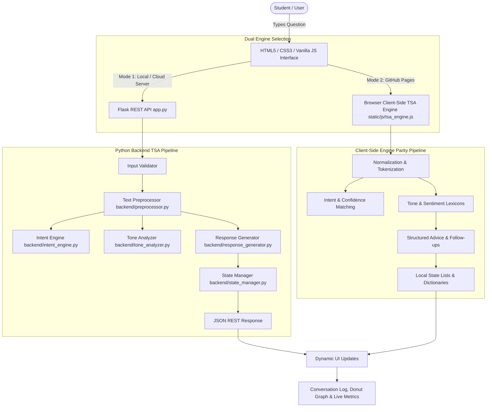

# EduAssist — Intelligent Student Support & Academic Guidance Chatbot

> **Tagline:** *Ask. Understand. Get Guidance.*  
> **Domain:** Text, Speech and Analysis (TSA) / Natural Language Processing  
> **Academic Level:** Undergraduate Mini-Project  
> **Live GitHub Pages URL:** [https://chiragroshan18.github.io/EduAssist/](https://chiragroshan18.github.io/EduAssist/)

[](https://chiragroshan18.github.io/EduAssist/)
[](https://www.python.org/)
[](https://flask.palletsprojects.com/)
[](LICENSE)

---

## 🚀 Live Demo & Online Access

EduAssist is deployed and hosted live on GitHub Pages with zero external backend dependencies:

👉 **[Launch EduAssist Live Web Application](https://chiragroshan18.github.io/EduAssist/)**

Click the link above to interact with the live student counseling assistant directly in your browser.

---

## 1. Project Overview

**EduAssist** is an intelligent, full-stack student academic support and guidance conversational chatbot developed for the **Text, Speech and Analysis (TSA)** domain. The system assists college and university students with recurring academic questions regarding:
- **Exam Preparation**: Revision cycles, past papers, test strategy, and subject-specific pacing.
- **Study Planning**: Pomodoro schedules, time-blocking, daily task prioritization, and procrastination mitigation.
- **Assignment Help**: Report formatting, structuring, citations, and plagiarism awareness.
- **Laboratory Guidance**: Viva voce preparation, practical experiment manuals, and record submission.
- **Attendance Regulations**: Minimum criteria, shortage tracking, and medical condonation policies.
- **General Academic Counseling**: GPA/CGPA improvement, elective selection, and faculty advising.

Rather than relying on opaque cloud APIs, black-box large language models, or heavy machine learning frameworks, EduAssist employs **transparent, deterministic, rule-based Natural Language Processing (NLP)**. The system performs raw text preprocessing, lexical tokenization, stop-word elimination, phrase density-based intent detection, rule-based confidence estimation, and lexical emotional tone analysis.

---

## 2. Dual-Engine Architecture

EduAssist features an honest dual-mode architectural design that preserves a complete **Python 3 + Flask REST API backend** while enabling zero-dependency public deployment on static hosts like **GitHub Pages**.

| Architecture Mode | Processing Engine | Client-Server Pipeline | Hosting Target |
| :--- | :--- | :--- | :--- |
| **Mode 1: Full Flask Application** | Python 3 + Flask REST API | Browser &rarr; Fetch API &rarr; Flask REST API (`app.py`) &rarr; Python NLP Engine &rarr; JSON | Localhost (`http://127.0.0.1:5000`) / Cloud Server |
| **Mode 2: GitHub Pages Demo** | Browser-Side TSA Engine (Vanilla JS) | Browser &rarr; Client-Side TSA Engine (`tsa_engine.js`) &rarr; In-Memory State &rarr; Dynamic UI | GitHub Pages Web Hosting (`https://chiragroshan18.github.io/EduAssist/`) |

### GitHub Pages Setup Instructions
1. Push this repository to GitHub: `https://github.com/chiragroshan18/EduAssist.git`
2. Navigate to **Settings** &rarr; **Pages** in your repository.
3. Under **Build and deployment** &rarr; **Source**, select **Deploy from a branch**.
4. Set **Branch** to `main` and folder to `/ (root)` or `/docs`, then click **Save**.
5. Your live site will immediately be accessible at:
   ```text
   https://chiragroshan18.github.io/EduAssist/
   ```

---

## 3. Problem Statement & Objective

### The Problem
University students frequently encounter repetitive academic queries regarding:
- Exam revision timelines and past paper practice
- Daily study scheduling and time-blocking
- Assignment structuring, referencing, and plagiarism prevention
- Laboratory viva preparation and practical manuals
- Attendance requirements and shortage condonation policies

Traditional static FAQ portals require students to manually navigate complex directory hierarchies, often leading to frustration and neglected guidance.

### The Objective
To engineer an interactive, conversational web application that:
1. Accepts natural-language student questions.
2. Preprocesses raw text (normalization, punctuation stripping, tokenization).
3. Detects student intent across 10+ academic categories.
4. Analyzes the tone/sentiment of the inquiry (`positive`, `neutral`, `concerned`, `frustrated`).
5. Generates structured, educational guidance and contextual follow-up recommendations.
6. Computes dynamic conversation statistics and intent distribution analytics from runtime lists/dictionaries (zero hardcoding).
7. Renders an interactive, pictorial **Emotional Tone Spectrum SVG Donut Graph**.
8. Provides a resilient **Restore Session ("↺ Restore")** capability to undo clear actions or restore baseline dialogues.
9. Generates printable executive conversation summaries for academic advisors.

---

## 4. Key Features & Highlights

- **Conversational Chat Interface:** Modern, glassmorphic chat workspace with student/bot avatars, formatted bulleted suggestions, and smooth auto-scrolling.
- **Rule-Based Intent Detection:** Categorizes incoming messages into 10+ academic intents with zero external ML overhead.
- **Transparent Confidence Scoring:** Calculates an exact, deterministic confidence percentage (e.g., 94%) derived from keyword and phrase density.
- **Rule-Based Tone / Sentiment Analysis:** Classifies emotional state into `positive`, `neutral`, `concerned`, or `frustrated` using specialized affective lexicons.
- **Pictorial Emotional Tone Spectrum (SVG Donut Chart):** Real-time vector donut graph displaying live distribution percentages of student sentiment and an academic wellness clarity index.
- **Conversational Context Memory:** Maintains short-term conversational context (e.g., prompting for an academic subject like *Computer Networks* and generating subject-specific preparation advice on the subsequent turn).
- **Session Restore ("↺ Restore"):** Instantly recovers cleared dialogue, intent distribution, and tone metrics from in-memory snapshots with thread-safe `RLock` re-entrancy.
- **Suggested Quick Questions:** Instant prompt chips for rapid testing and student navigation.
- **Live Text Analysis Inspector:** Real-time side panel displaying the normalized input snippet, detected intent, confidence bar, tone badge, and extracted keywords.
- **Dynamic Session Dashboard:** Real-time metrics tracking Total Messages, Student Queries, Bot Responses, Dominant Tone, and Session Duration without hardcoded values.
- **Intent Analytics Distribution:** Visual bar charts reflecting the distribution of student questions across categories.
- **Executive Counseling Synthesis:** Modal synthesizing the dialogue into an executive summary highlighting primary topic, dominant tone, key topics, and faculty recommendations.
- **A4-Friendly Conversation Report / Export:** Dedicated print stylesheet (`print.css`) producing a clean academic transcript for advisors or portfolio records.
- **Interactive Micro-Interactions:** Subtle Web Audio synthesizer chimes for sent/received messages, animated counter rolls, and instant Dark/Light theme switching.

---

## 5. Technology Stack

- **Frontend:** HTML5, Modern CSS3 (Custom Design System, Flexbox/Grid, CSS Variables, Glassmorphism), Vanilla JavaScript (ES6+). Zero third-party JS/CSS frameworks.
- **Backend:** Python 3.10+, Flask 3.x, Flask-CORS.
- **API Protocol:** REST API communicating via Fetch API and standard JSON.
- **State Management:** Thread-safe in-memory lists and dictionaries (`conversation = []`, `intent_counts = {}`, `tone_counts = {}`).
- **Testing:** 75 Python unit/integration tests and 49 Node.js verification tests (strictly ignored in `.gitignore` for clean production deployment).
- **Deployment Compatibility:** Works locally with Flask or statically on GitHub Pages.

---

## 6. System Architecture



---

## 7. Supported Intents & Sample Inquiries

| Intent Category | Description | Sample Student Query |
| :--- | :--- | :--- |
| **Greeting** | Welcome, opening conversational greetings | `"Hello! How can EduAssist help me today?"` |
| **Exam Preparation** | Revision cycles, past papers, test strategies | `"How should I prepare for my examinations?"` |
| **Study Planning** | Timetable management, Pomodoro scheduling | `"Help me create a daily study schedule"` |
| **Assignment Help** | Report formatting, citations, plagiarism rules | `"How do I structure my project assignment?"` |
| **Laboratory Guidance** | Viva voce preparation, practical experiment logs | `"How should I prepare for my lab viva?"` |
| **Attendance** | Minimum attendance rules, medical condonation | `"What happens if my attendance drops below 75%?"` |
| **Course Information** | Course prerequisites, syllabus, credit distribution | `"Where can I find my course syllabus and credits?"` |
| **General Academic Guidance** | CGPA calculation, backlogs, academic advising | `"How can I improve my CGPA and clear backlogs?"` |
| **Motivation & Well-being** | Exam anxiety, academic stress management | `"I feel overwhelmed and stressed about my tests"` |
| **Goodbye** | Closure and polite departures | `"Thank you, that answers all my questions. Bye!"` |
| **Unknown / Fallback** | Unrecognized inquiries outside academic scope | `"What is the weather in Paris?"` |

---

## 8. Rule-Based NLP Pipeline Explained

### 1. Text Preprocessing (`backend/preprocessor.py`)
- **Whitespace Normalization**: Collapses extraneous spaces, tabs, and newlines into single spaces.
- **Punctuation Stripping**: Preserves alphanumeric characters and internal hyphens (`mid-term`, `pre-requisite`).
- **Tokenization**: Splits text into lowercase alphanumeric tokens.
- **Keyword Extraction**: Filters 120+ standard English stop-words and isolates key academic terms.

### 2. Intent Detection & Confidence Scoring (`backend/intent_engine.py`)
- Evaluates phrase matches (weighted 2.5×) and keyword matches (weighted 1.0×).
- Calculates a deterministic rule-based confidence score:
  $$\text{Confidence} = \min(0.55 + \text{Score} \times 0.12, 0.96)$$

### 3. Emotional Tone / Sentiment Analysis (`backend/tone_analyzer.py`)
- Scans normalized tokens against specialized affective lexicons (`positive`, `concerned`, `frustrated`).
- Detects punctuation indicators (`!`, `?!`) to amplify frustration or concern intensity.
- Neutral fallback applied when no emotional indicators are triggered.

### 4. Context-Aware Multi-Turn Follow-Ups (`backend/response_generator.py`)
- When a student asks about exam preparation without specifying a subject, the bot prompts:
  > *"Which subject are you preparing for? (e.g., Computer Networks, Database Systems)"*
- Sets short-term context: `state: "awaiting_subject"`.
- When the student replies with just `"Computer Networks"`, EduAssist resolves the query as `exam_preparation` for Computer Networks.

---

## 9. Dynamic State & Donut Graph Math

All conversational statistics are dynamically calculated from runtime in-memory lists and dictionaries:
- `conversation = []`: Chronological list of message objects.
- `intent_counts = {}`: Frequency mapping of detected intents.
- `tone_counts = {}`: Real-time emotional distribution dictionary.

### SVG Donut Graph Calculation
The donut ring has a radius $r = 48$, giving a total circumference:
$$C = 2 \times \pi \times 48 \approx 301.59$$
For each tone $i$ with count $n_i$ and total student queries $N$:
$$\text{Slice Length}_i = \frac{n_i}{N} \times C$$
$$\text{stroke-dasharray} = \text{Slice Length}_i \quad C$$
$$\text{stroke-dashoffset} = -\sum_{k < i} \text{Slice Length}_k$$

---

## 10. Local Installation & Setup

### Prerequisites
- Python 3.10 or higher
- Git

### Step-by-Step Instructions

1. **Clone the repository:**
   ```bash
   git clone https://github.com/chiragroshan18/EduAssist.git
   cd EduAssist
   ```

2. **Create and activate a virtual environment (optional but recommended):**
   ```bash
   python -m venv venv
   # Windows:
   venv\Scripts\activate
   # macOS/Linux:
   source venv/bin/activate
   ```

3. **Install dependencies:**
   ```bash
   pip install -r requirements.txt
   ```

4. **Launch the Flask application:**
   ```bash
   python app.py
   ```

5. **Open in your browser:**
   ```text
   http://127.0.0.1:5000
   ```

---

## 11. REST API Specification

### `POST /api/chat`
Process a student query and generate an educational response.
- **Request Body:**
  ```json
  { "message": "How can I prepare for my examinations?" }
  ```
- **Response (200 OK):**
  ```json
  {
    "success": true,
    "intent": "exam_preparation",
    "intent_label": "Exam Preparation",
    "confidence": 0.88,
    "tone": "neutral",
    "keywords": ["prepare", "examinations"],
    "response": "For effective Exam Preparation, follow this 4-step framework...",
    "follow_ups": ["Computer Networks", "Database Management Systems", "Help me create a study plan"]
  }
  ```

### `GET /api/dashboard`
Retrieve runtime conversation statistics, intent distribution, and tone distribution.

### `POST /api/conversation/clear`
Reset active conversation and back up state in memory.

### `POST /api/conversation/restore`
Restore previously cleared conversation or load baseline demo dialogue (`200 OK`).

### `POST /api/analyze`
Generate an executive academic counseling summary with primary topics and faculty recommendations.

---

## 12. Automated Testing Suite

All tests are maintained locally for validation and excluded from the production repository via `.gitignore`.

### Running Python Tests
```bash
python -m unittest discover tests -v
```
**Results:** **75 tests passing (0 failures)** covering input validation, XSS handling, all 10 core intents, unknown fallbacks, tone classification, multi-turn contexts, session restore, and REST endpoints.

---

## 13. Project Directory Structure

```text
EduAssist/
│
├── app.py                      # Flask application entry point & REST API router
├── requirements.txt            # Minimal dependencies (Flask, flask-cors)
├── README.md                   # Comprehensive academic documentation & deployment guide
├── .gitignore                  # Production exclusion rules (tests/, caches, scratch/)
├── index.html                  # Standalone SPA root entry point (GitHub Pages)
│
├── backend/                    # Python Backend TSA / NLP Processing Modules
│   ├── __init__.py
│   ├── config.py               # Intent patterns, keywords, tone lexicons, stop words
│   ├── preprocessor.py         # Whitespace normalization, tokenization, keywords
│   ├── intent_engine.py        # Rule-based intent detection & deterministic confidence
│   ├── tone_analyzer.py        # Rule-based emotional tone / sentiment analyzer
│   ├── response_generator.py   # Educational guidance, follow-up chips & context
│   └── state_manager.py        # Thread-safe in-memory session state & RLock backups
│
├── static/                     # Primary Web Application Bundle (served by Flask)
│   ├── index.html              # Main SPA HTML5 interface
│   ├── css/
│   │   ├── styles.css          # Glassmorphic educational UI design system
│   │   └── print.css           # A4-friendly printable conversation transcript
│   └── js/
│       ├── app.js              # UI controller, animations, SVG donut, modals
│       ├── api_client.js       # Dual-engine API client (Flask REST vs Client TSA)
│       └── tsa_engine.js       # Zero-dependency client-side NLP engine for GitHub Pages
│
├── docs/                       # Pre-configured directory for GitHub Pages /docs source
│   ├── index.html
│   ├── css/
│   └── js/
│
└── github-pages/               # Standalone static distribution package
    ├── index.html
    ├── css/
    └── js/
```

---

## 14. Academic Integrity & Disclosure

This project was developed for a college-level **Text, Speech and Analysis (TSA)** mini-project.
- All text processing, tokenization, intent matching, tone estimation, and confidence calculation algorithms are implemented via **transparent, deterministic, rule-based logic**.
- The system does not utilize external generative AI APIs (such as OpenAI, Gemini, or Claude) or third-party cloud database providers.
- The dual-engine architecture transparently indicates whether the active computation is performed by the Python Flask REST API or the client-side JavaScript engine.

---

## 15. License

This project is licensed under the **MIT License**. Feel free to use, modify, and distribute for educational purposes.
